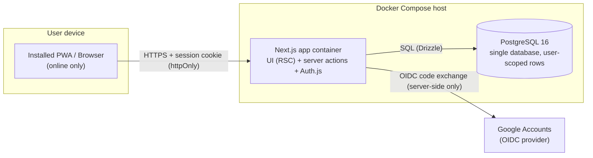
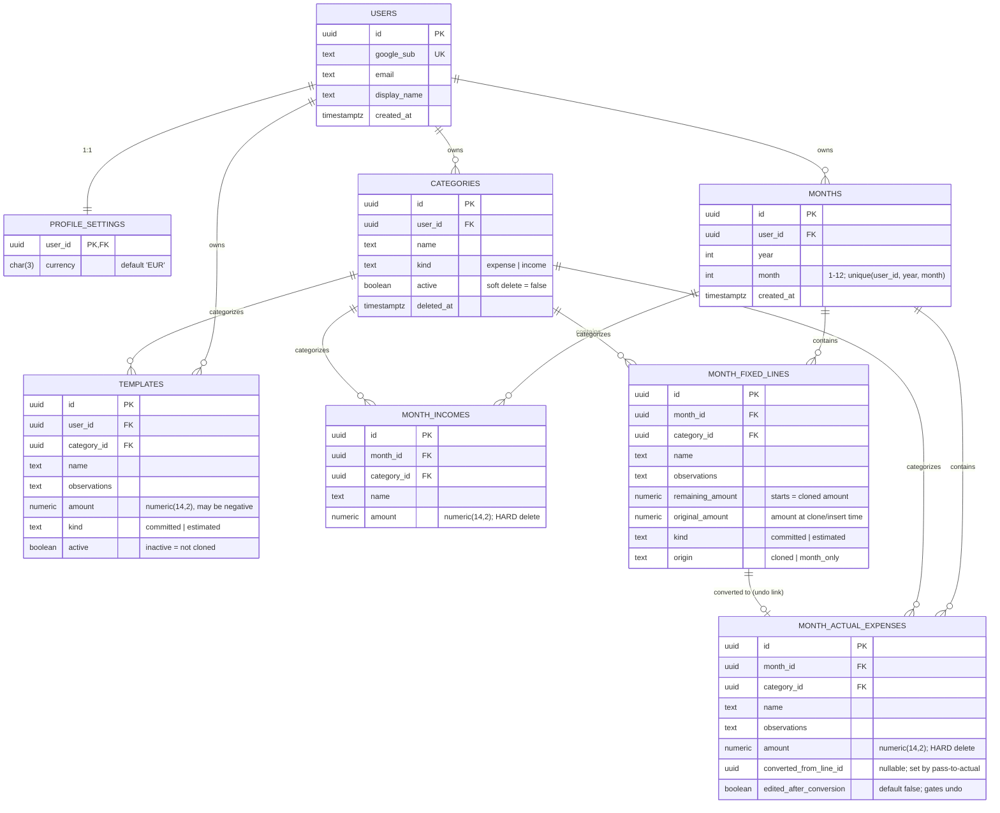
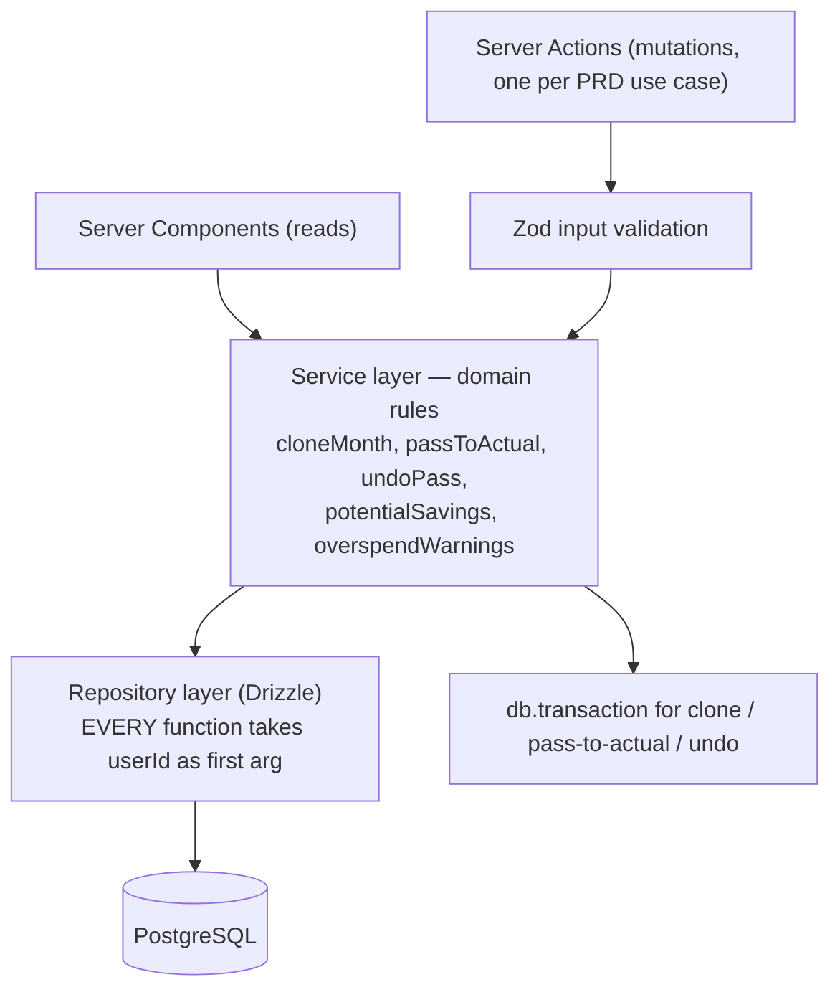

# ARCHITECTURE — Monthly Expenses

> **Audience:** coding agents and humans scaffolding/implemented this repo.
> **Source of truth for product behavior:** `docs/prd.md` (the PRD). This document is the source of truth for *how* it is built. Where they conflict, the PRD wins for behavior, this doc wins for tech.
> **Status:** Approved for MVP scaffolding.

---

## 1. System overview

A personal, multi-tenant expense-tracking **PWA**. One Next.js application serves the UI and the entire backend (BFF pattern). PostgreSQL is the only datastore. Google is the only identity provider; an env-var allowlist gates access. There is **no Keycloak, no separate API service, no separate frontend app**.



Key properties:

- **Single deployable.** UI, auth, domain logic, and data access ship in one container. Compose = `app` + `postgres` (PRD C5).
- **No bearer tokens in the browser.** Google tokens are exchanged server-side by Auth.js; the browser only holds an httpOnly session cookie.
- **Online-only.** The PWA requirement is *installability* (manifest + service worker), not offline sync (PRD C11).
- **Every money query is tenant-scoped.** A missing `user_id` filter is a P0 bug (PRD §5.1). This is enforced in the repository layer, not by convention alone (see §7).

---

## 2. Architecture decisions (ADRs)

| ID | Decision | Alternatives rejected | Rationale |
| --- | --- | --- | --- |
| ADR-1 | **Next.js (App Router) full-stack BFF** | Vite SPA + separate Go/Python API; Next.js front + separate API | Small app, solo dev, agent-driven: one TS codebase, one repo, one container. A standalone API adds a contract + a second service with no consumer other than this PWA. |
| ADR-2 | **Auth.js v5 (`next-auth`) with the Google provider only** | Keycloak (broker); Better Auth; custom OIDC | PRD C2 requires Google sign-in + env allowlist and nothing else. Keycloak is operational overhead (realm config, upgrades, stateful service) for zero MVP benefit. Can be added later as another Auth.js provider without app changes. |
| ADR-3 | **JWT session strategy, no Auth.js DB adapter** | Database sessions via Drizzle adapter | Allowlisted app with few users. Our own `users` table keyed by Google `sub`; session carries internal `userId`. Schema stays fully ours. |
| ADR-4 | **Drizzle ORM + `drizzle-kit` migrations** | Prisma; raw SQL; sqlc | Thin, SQL-shaped, excellent agent codegen, first-class Postgres `numeric` support. |
| ADR-5 | **Money = `numeric(14,2)` in DB, integer cents in domain code** | `float`/`double` anywhere | PRD §7: exact 2-decimal algebra, negatives allowed. Floats are forbidden (see §8). |
| ADR-6 | **Reads in React Server Components; mutations as Server Actions** | REST route handlers for everything | Idiomatic App Router, end-to-end types with no OpenAPI contract to maintain. One server action per PRD use case. |
| ADR-7 | **Serwist (`@serwist/next`) for PWA** | next-pwa (unmaintained); custom SW | Maintained Workbox successor with App Router support. Minimal config: precache app shell only; all data is online (PRD C11). |
| ADR-8 | **next-intl for i18n** | react-i18next; DIY | App Router support, cookie-persisted locale, matches PRD C4 (`en`/`es`, browser locale fallback). |
| ADR-9 | **Tailwind + shadcn/ui** | MUI; Chakra; plain CSS | Mobile-first (PRD §10), agents generate competent UI with it, tree-shakeable. |
| ADR-10 | **Vitest (unit/domain) + Playwright (E2E)** | Jest; Cypress | Vitest is native to the Vite-era toolchain; Playwright covers the PRD UC flows in a real browser. |

---

## 3. Authentication & authorization

### 3.1 Sign-in flow

```mermaid
sequenceDiagram
    autonumber
    participant B as Browser
    participant A as Next.js (Auth.js)
    participant G as Google
    participant D as PostgreSQL

    B->>A: GET /api/auth/signin/google
    A-->>B: 302 to Google consent
    B->>G: credentials + consent
    G-->>B: 302 /api/auth/callback/google?code=...
    B->>A: callback with code
    A->>G: code exchange (server-side, client secret)
    G-->>A: id_token (sub, email, name, picture)
    A->>A: signIn callback: normalize email (trim, lowercase)<br/>check against ALLOWED_EMAILS
    alt email NOT allowlisted (PRD C3)
        A-->>B: 302 /403 — no session, no user row, no tenant data
    else allowlisted
        A->>D: upsert user by google sub;<br/>first login: insert profile_settings(currency='EUR') (PRD UC-01)
        A->>A: jwt callback: token.userId = internal user id
        A-->>B: httpOnly session cookie (JWT)
        B->>A: app requests carry cookie; server reads session via auth()
    end
```

### 3.2 Rules (normative)

1. The allowlist is the `signIn` callback. Source: `ALLOWED_EMAILS` env var, comma-separated, normalized trim + lowercase (PRD §5.2). Deny → `return false` → user lands on `/403` (i18n page, PRD C3).
2. Denied users get **no session and no database rows**. Never provision a user before the allowlist check passes.
3. Internal identity = `users.id` (uuid). External identity = `users.google_sub`. The session JWT carries `userId`; server code never trusts client-supplied user ids.
4. Session checks live in the **data-access layer** (`requireUserId()`), not only in middleware. Middleware matcher gaps are a known Auth.js footgun; defense in depth is mandatory.
5. `AUTH_SECRET`, `AUTH_GOOGLE_ID`, `AUTH_GOOGLE_SECRET` come from env. Google Cloud Console redirect URIs: `https://expenses.jmsola.dev/api/auth/callback/google` and `http://localhost:3000/api/auth/callback/google`.

---

## 4. Data model

Logical model from PRD §6, physicalized. All tables except `users`/`profile_settings` carry `user_id` (directly or via `months`) and all queries filter by it.



Invariants enforced by the schema and service layer:

- `unique(user_id, year, month)` on `MONTHS` — duplicate month creation is rejected (PRD UC-08).
- Category name unique per `(user_id, kind)` **among active rows** (partial unique index `WHERE active`) (PRD §6.2).
- Soft delete only on `CATEGORIES`, `TEMPLATES` (and future catalogs). Hard delete on all month-scoped money rows (PRD §13).
- `converted_from_line_id` + `edited_after_conversion` implement PRD §7.5 undo: undo allowed only while the actual is unedited; the conversion and its undo run in **one transaction** each.

---

## 5. Request flow & layering



Rules:

1. **Repositories require `userId` as an explicit first parameter** and apply it in every `WHERE`. There is no way to call a repository without a tenant id. This is the enforcement mechanism for PRD §5.1.
2. Services contain all money rules (PRD §7): potential savings, no double-count, clone-once snapshot, pass-to-actual (committed only), overspend vs **active template** sums.
3. Server actions are thin: parse with Zod → call service → revalidate. No business logic in actions, components, or `route.ts` files. **Reads** (including Search, UC-16) stay in RSC: GET `?q=` → service → repository SQL. Do not add a mutation-shaped server action for a search.
4. Amounts cross the wire as **strings** (`"1234.56"`). Zod schema: `^-?\d{1,12}\.\d{2}$` (PRD C9: dot decimal, 2 places, may be negative).

---

## 6. Project structure

```text
expenses/
├── docker-compose.yml
├── Dockerfile                     # multi-stage, node:22-alpine, output: 'standalone'
├── .env.example
├── AGENTS.md                      # agent conventions (points here + to docs/prd.md)
├── docs/
│   ├── prd.md                     # product source of truth
│   └── architecture.md            # this file
├── drizzle/                       # generated migrations
├── public/
│   └── icons/                     # PWA icons (192, 512, maskable)
├── src/
│   ├── auth.ts                    # Auth.js v5 config (Google provider, allowlist, jwt/session callbacks)
│   ├── middleware.ts              # locale + auth edge guards (NOT the only auth check)
│   ├── app/
│   │   ├── api/auth/[...nextauth]/route.ts
│   │   ├── manifest.ts            # PWA manifest
│   │   ├── sw.ts                  # Serwist service worker
│   │   ├── [locale]/
│   │   │   ├── sign-in/page.tsx
│   │   │   ├── 403/page.tsx
│   │   │   ├── page.tsx           # month list / empty state (never auto-creates, PRD C12)
│   │   │   ├── months/[year]/[month]/page.tsx   # month workspace (mobile-first)
│   │   │   ├── stats/page.tsx                   # Global Stats (UC-15)
│   │   │   ├── history/page.tsx
│   │   │   ├── search/page.tsx                  # Search actuals (UC-16)
│   │   │   ├── annuals/page.tsx
│   │   │   ├── categories/page.tsx              # expense + income tabs
│   │   │   ├── templates/page.tsx
│   │   │   └── settings/page.tsx                # currency
│   │   └── layout.tsx
│   ├── server/
│   │   ├── db/
│   │   │   ├── schema.ts          # Drizzle schema = §4 of this doc
│   │   │   └── client.ts
│   │   ├── repositories/          # userId-first data access; the ONLY place SQL lives
│   │   ├── services/              # domain logic; transactions live here
│   │   └── money.ts               # cents-based arithmetic helpers
│   ├── actions/                   # server actions, one file per PRD use case
│   ├── components/
│   │   ├── ui/                    # shadcn/ui
│   │   └── ...                    # feature components (client components only where interactive)
│   └── i18n/
│       ├── messages/en.json
│       └── messages/es.json
├── tests/
│   ├── unit/                      # Vitest: money rules, clone, pass-to-actual (PRD §15)
│   ├── integration/               # Vitest + real Postgres (compose service)
│   └── e2e/                       # Playwright: UC-01…UC-19 happy paths
└── package.json
```

---

## 7. PWA, i18n, cookies

- **PWA:** Serwist generates the SW at build; precache the app shell only. No runtime caching of API/data responses — data is online-only (PRD C11). `manifest.ts` provides name, `expenses.jmsola.dev` start URL, icons, `display: 'standalone'`. A permanent install affordance is shown when the browser reports not-installed (PRD UC-04).
- **i18n:** next-intl with locales `en`, `es`. Resolution: persisted cookie → browser `Accept-Language` → `en` (PRD C4). All user-facing strings are keyed, including 403, validation errors, past-month warning, overspend warning (PRD §11). Month names come from locale, never hardcoded.
- **Cookies (PRD §5.4):** `locale` and `last_opened_month` (`year` + `month`). These are UX conveniences, never security boundaries. Home reads `last_opened_month` and resumes it only if that month exists; otherwise shows the month list (PRD UC-14).

---

## 8. Money handling (normative)

1. DB columns: `numeric(14,2)`. Never `float`, `real`, or JS `number` arithmetic on amounts.
2. Domain code converts to **integer cents** on entry and back to `"1234.56"` strings on exit (wire + amount input). All sums (potential savings, overspend baselines) are integer-cents algebra — including negatives (PRD §7.6). **Display** via `formatMoney` adds a comma thousands separator (`1,234.56 €`); the decimal remains a dot in both locales.
3. Potential savings (PRD §7.1): `sum(incomes) − (sum(actuals) + sum(remaining_amount of fixed/estimated lines))`. Hard-deleted rows are excluded by virtue of being gone.
4. Overspend warning (PRD §7.4): `sum(actuals in category)` vs `sum(ACTIVE TEMPLATE amounts in category)` (committed + estimated) — never the month remaining. Warn only, never block. Categories with no active templates get no warning.
5. **Percent change (UC-15):** `ratioChangeToPercentTenths(currentCents, priorCents)` returns `(current/prior − 1)` as integer tenths of a percent (25.0% → `250`), half-up. Omit when `prior === 0`. Never divide euro floats.
6. **CAGR (UC-15):** `cagrPercentTenths(startCents, endCents, years)` is `(end/start)^(1/n) − 1` via an integer nth-root of a scaled cents ratio — **not** `Math.pow` on euro amounts. Skip when `startCents === 0` (treat as a new category instead). `formatPercentTenths` renders the 1-decimal string.

---

## 9. Local dev & deployment

```yaml
# docker-compose.yml (shape — agent fills in details)
services:
  app:
    build: .
    ports: ["3000:3000"]
    env_file: .env
    depends_on:
      db:
        condition: service_healthy
  db:
    image: postgres:16-alpine
    environment:
      POSTGRES_DB: expenses
      POSTGRES_USER: expenses
      POSTGRES_PASSWORD: ${DB_PASSWORD}
    volumes: ["pgdata:/var/lib/postgresql/data"]
    healthcheck:
      test: ["CMD-SHELL", "pg_isready -U expenses"]
      interval: 5s
      retries: 10
volumes:
  pgdata:
```

Environment variables (`.env.example` must list all):

| Var | Purpose |
| --- | --- |
| `AUTH_SECRET` | Auth.js session encryption (`npx auth secret`) |
| `AUTH_GOOGLE_ID` / `AUTH_GOOGLE_SECRET` | Google OAuth web client |
| `ALLOWED_EMAILS` | Comma-separated allowlist (PRD C2) |
| `DATABASE_URL` | `postgres://expenses:***@db:5432/expenses` |
| `NEXT_PUBLIC_APP_URL` | `https://expenses.jmsola.dev` |

Target deployment: single Compose project on the home server, behind the existing Cloudflare wildcard cert for `*.jmsola.dev`. Migrations run via `drizzle-kit migrate` on container start (or a one-shot migrate service).

---

## 10. Scaffolding instructions for the agent

Execute in order. Do not deviate from ADRs without asking.

```bash
npx create-next-app@latest expenses --typescript --tailwind --eslint \
  --app --src-dir --import-alias "@/*" --turbopack
cd expenses
npm i next-auth@beta drizzle-orm postgres zod next-intl
npm i -D drizzle-kit tsx
npx shadcn@latest init
npm i @serwist/next serwist
npm i -D vitest @vitejs/plugin-react playwright @playwright/test
```

Then:

1. Write `src/server/db/schema.ts` from §4 and generate the first migration.
2. Write `src/auth.ts` implementing §3 exactly (allowlist in `signIn`, `userId` in jwt/session callbacks, `pages.error = '/403'`).
3. Implement repositories with the `userId`-first rule, then services, then server actions — following the PRD §18 build order.
4. Wire Serwist + `manifest.ts`, then next-intl with the cookie rule from §7.
5. Translate PRD §15 test scenarios 1–19 into Vitest/Playwright specs **before** implementing the corresponding features (TDD against the PRD).
6. `docker compose up` must yield a working app: sign-in → allowlist → create month → clone → add actual → savings number.

Definition of done per feature: typecheck + lint clean, PRD scenario tests green, and no `userId`-less repository call exists.
