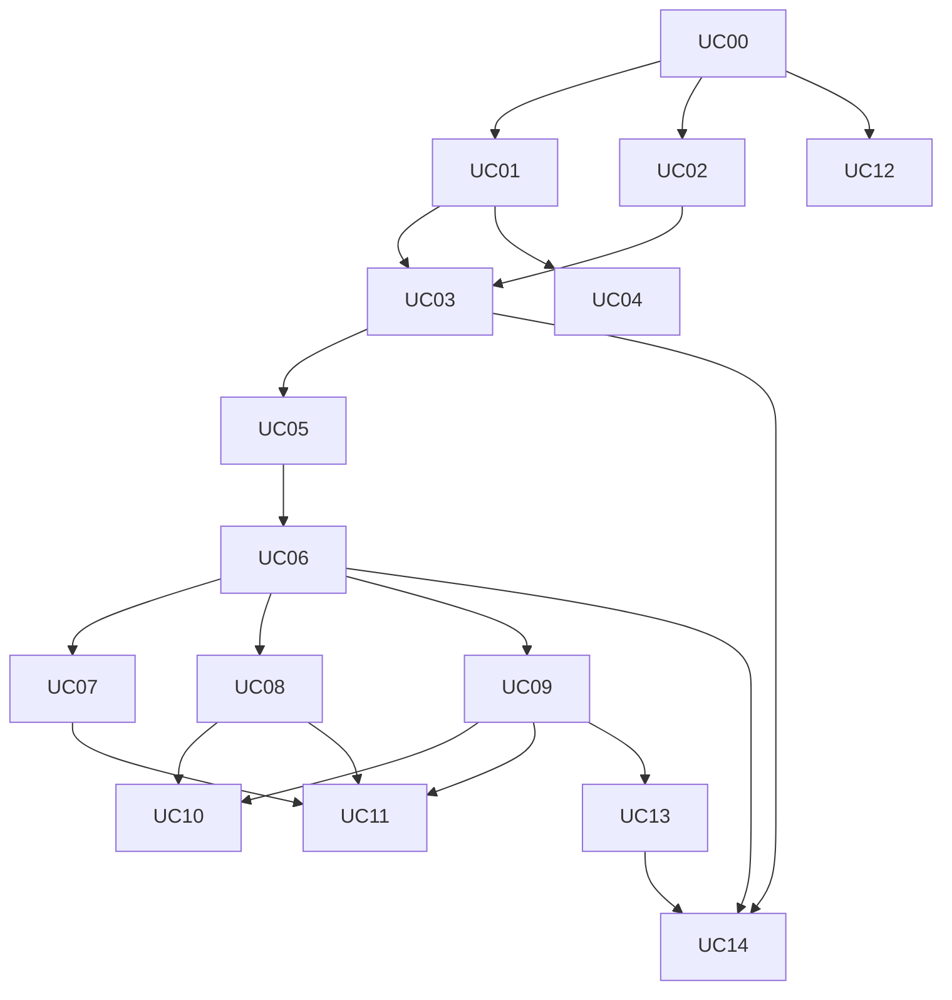

# Monthly Expenses — Use-case index

> **App:** Monthly Expenses PWA (`https://expenses.jmsola.dev`)
> **Behavior source of truth:** `docs/prds/GLOBAL.md` · **Tech source of truth:** `docs/architecture/ARCHITECTURE.md`
> **Database:** defined in `docs/database/database.dbml`. UC-00 creates everything in one migration — EXCEPT `annual`, which arrives with UC-14 (migration 0002, the only post-UC-00 schema change).

## How to work with these files

- Implement **UC-00 first**: it scaffolds the repo and applies the database migration. Every other file assumes the schema exists.
- One file = one implementable slice: server actions + service + repository + screen, following the layering in ARCH §5 (RSC reads, server actions for mutations, Zod validation, services own domain rules and transactions, repositories own SQL).
- Definition of done per file (ARCH §10): typecheck + lint clean, mapped PRD §15 test scenarios green, no `userId`-less repository call.

## Global invariants (apply in EVERY file)

- **Tenancy:** every repository function takes `userId` as first argument and filters by it in every `WHERE` (PRD §5.1 — a missing filter is a P0 bug; ARCH §5 rule 1).
- **Money:** amounts cross the wire as strings matching `^-?\d{1,12}\.\d{2}$`; domain code uses integer cents; DB uses `numeric(14,2)`; never floats (ADR-5, ARCH §8).
- **Deletes:** soft delete for catalogs (`category`, `template`, `annual`); hard delete for month-scoped money rows (PRD §13).
- **i18n:** every user-facing string is keyed (`en`/`es`), including errors and warnings (PRD §11).
- **No auto-months:** nothing creates a month implicitly, anywhere (PRD C6/C12). Annuals (UC-14) also never auto-create lines — they only remind.
- **Schema:** no slice changes the schema — the sole exception is UC-14, which adds the `annual` table via migration 0002.

## Build order and dependencies

| File | Slice | PRD coverage | Depends on |
| --- | --- | --- | --- |
| UC-00 | Foundations & database bootstrap | C5, C9, §16 | — |
| UC-01 | Google sign-in, allowlist & tenancy | UC-01, UC-02, UC-17, C1–C3 | UC-00 |
| UC-02 | i18n shell (en/es) | UC-03, C4, §11 | UC-00 |
| UC-03 | Categories (expense & income) | UC-05, UC-06, C10 | UC-01, UC-02 |
| UC-04 | Profile settings (currency) | UC-15, C9 | UC-01 |
| UC-05 | Fixed/estimated templates | UC-07, §6.3 | UC-03 |
| UC-06 | Month creation, cloning & home | UC-08, UC-14, UC-19, C6, C7, C12, C17 | UC-01, UC-03, UC-05 |
| UC-07 | Month incomes | UC-09, §6.5 | UC-06 |
| UC-08 | Actual expenses | UC-10, UC-16, C13 | UC-06 |
| UC-09 | Reserved lines (remaining, month-only) | UC-11, UC-18, §7.3 | UC-06 |
| UC-10 | Pass to actual & undo | UC-12, §7.5 | UC-08, UC-09 |
| UC-11 | Summary, savings & warnings | UC-13, UC-14, §7.1, §7.4, C8, C18 | UC-07, UC-08, UC-09 |
| UC-12 | PWA install | UC-04, C11 | UC-00 (slot anywhere) |
| UC-13 | One-off month expenses (special occasions) | UC-18, §6.6, §7.8 | UC-09 (reuses its `addMonthOnlyLine`; no new backend) |
| UC-14 | Annuals (yearly expense reminders) | PO decision 2026-08-25 — pending PRD merge; extends §6/§10/§13 | UC-03, UC-06 (recommend after UC-11 + UC-13). **Adds `annual` table (migration 0002)** |

## PRD §15 test-scenario map

| Scenario | File(s) |
| --- | --- |
| 1 Allowlist hit/miss (403, no leak) | UC-01 |
| 2 Two users isolated | UC-01 |
| 3 Create Aug 2026 twice → second fails | UC-06 |
| 4 App never creates a month by itself | UC-06 |
| 5 Clone mortgage 800 + groceries 400 + income 2000 → savings 800 | UC-06 + UC-07 + UC-11 |
| 6 Grocery ticket 50, remaining untouched → savings 750 | UC-08 + UC-11 |
| 7 Groceries remaining 350 → savings 800 | UC-09 + UC-11 |
| 8 Pass mortgage to actual → savings 800, only in actuals | UC-10 + UC-11 |
| 9 Undo pass (unedited) → back in fixed | UC-10 |
| 10 Edit actual after pass → no undo | UC-10 |
| 11 Inactive category blocked on new ticket; old ticket visible | UC-03 + UC-08 |
| 12 Estimated line can pass to actual (extended) | UC-10 |
| 13 Edit July in August → warning + persist | UC-11 |
| 14 Actual −20 increases savings by 20 | UC-08 + UC-11 |
| 15 Hard-delete actual → gone from sums | UC-08 |
| 16 Soft-delete category → hidden from pickers; history intact | UC-03 |
| 17 One-off August 30 → September has no 30 | UC-09 + UC-06 (E2E flow in UC-13) |
| 18 August remaining 100 → September remaining is template 400 | UC-09 + UC-06 |
| 19 Overspend: templates 400+50, actuals 500 → warning | UC-11 |

UC-14 has no PRD §15 scenario (feature postdates PRD v1); its acceptance tests live in the UC-14 file.
